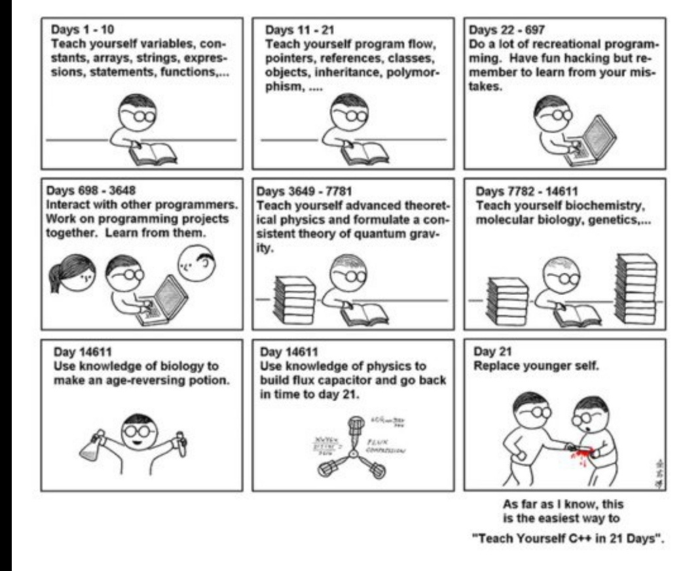

# Lenguaje de Programación 1



En el curso veremos las herramientas proporcionadas por el lenguaje `C++`, implementando programas
con las técnicas de estructuras de datos y programación orientada  a objetos.

## Programa Analítico

> Desde el 2023-2, los siguiente temas se dejaron de dictar, puesto que ahora se
> dictan en un curso previo:

| Temas que ya no enseñan      | Clase                                                                                                        |                                                 Codigo                                                  |
| ---------------------------- | ------------------------------------------------------------------------------------------------------------ | :-----------------------------------------------------------------------------------------------------: |
| Introducción al Lenguaje C++ | [Compilación de un programa](Resumen/ResumenTemasPasados/01Compilacion.md)                                   |                           [`main.c`](Codigos/TemasPasados/01Compiler/main.c)                            |
| Entrada y Salida de Datos    | [`std::cout`](Resumen/ResumenTemasPasados/02Cout.md) <br> [`std::cin`](Resumen/ResumenTemasPasados/03Cin.md) | [`cout.cpp`](Codigos/TemasPasados/02Cout/cout.cpp) <br> [`cin.cpp`](Codigos/TemasPasados/03Cin/cin.cpp) |
| Archivos                     | [Archivo de Texto](Resumen/ResumenTemasPasados/04Archivo.md)                                                 |                     [`archivos.cpp`](Codigos/TemasPasados/04Archivos/archivos.cpp)                      |

<h3> Nuevo temario</h3>

| Temas a tratar                                  | Clase | Codigo |
| ----------------------------------------------- | :---: | :----: |
| Funciones y Alcance de las variables            |       |        |
| Arreglos y Punteros                             |       |        |
| Programación Orientada a Objetos                |       |        |
| Operadores Sobrecargados                        |       |        |
| Herencia                                        |       |        |
| Punteros a Objetos                              |       |        |
| Plantillas y Bibliotecas Estándar de Plantillas |       |        |
| Lenguaje de Programación JAVA                   |       |        |

## Software para las clases

Durante las clases y evaluaciones, por decisión de los profesores se estará utilizando el IDE [ Apache NetBeans](https://netbeans.apache.org)

Así que se aconseja que para mejorar la velocidad de uno mientras programa, practicar [typing ⌨️](https://www.typingclub.com/) y buscar los atajos 
de teclado proporcionados por el mismo IDE.

## Organización del Repositorio

- `Resumen:` son los resúmenes que eh realizado de las clases, y que también se encuentran en la wiki de este repositorio
- `Codigos:` son los pequeños programas para ejemplificar lo aprendido en cada clase.
- `Evaluaciones:` se encuentras las evaluaciones de ciclos pasadas.

Tener en consideración que todos los códigos de ejemplo de los `TemasPasados`, vienen con un archivo `compilacion.sh`. Esto para que no tengan que estar ejecutando
a mano y porque algunas veces se hacer redireccionamiento a un `archivo.txt`; y para que puedan ejecutarlo es con el siguiente comando:

```bash
bash compilacion.sh
```

Para los ejemplo de los temas que continuan en el temario estaré usando un `makefile`,
el cual para ejecutarlo tienen que verificar si esta instalado en su computador
en caso contario, tendrá que instalarlo y para que pueda ejecutarlo es con los
siguientes comandos:

```bash
make
./nombre_del_ejectuable_de_la_carpeta.exe
```

## ¿Porqué no uso el `using namespace std`?

A lo largo de mis resúmenes y código de ejemplo que tengo, no voy a utilizar el clásico comando de `using namespace std`
Esto principalmente, como una buena practica de programación, para esto voy a citar a Stroustrup's y mostrar un ejemplo de la vida real.

Un caso practico donde esto no es para nada recomendable hacer uso de `using namespace std`, es si por ejemplo 
tenemos que trabajar con [EASTL](https://github.com/electronicarts/EASTL), el cual es un reemplazo del `standard template library`, donde vamos a encontrar los
mismos nombre de `STD`. Por lo tanto, no podríamos diferenciar si estamos usando el `EASTL` o el `STD`, además de que va a
generar conflicto de nombres, y justamente por esta razón fue que se crearon los `namespace`.

```
Bjarne Stroustrup's(The C++ Programming Language 4th Edition):

For simplicity, I will rarely use the std:: prefix explicitly in examples.


It is generally in poor taste to dump every name from a namespace into the global namespace. However, in this book, I use the standard library almost exclusively and it is good to know what it offers. So, I don’t prefix every use of a standard library name with std::.


Often, we like to use every name from a namespace without qualification. That can be achieved by providing a using-declaration for each name from the namespace, but that’s tedious and requires extra work each time a new name is added to or removed from the namespace. Alternatively, we can use a using-directive to request that every name from a namespace be accessible in our scope without qualification.


Using a using-directive to make names from a frequently used and well-known library available without qualification is a popular technique for simplifying code. This is the technique used to access standard-library facilities throughout this book.


Within a function, a using-directive can be safely used as a notational convenience, but care should be taken with global using-directives because overuse can lead to exactly the name clashes that namespaces were introduced to avoid.
```

> Si bien para las evaluaciones por cuestión de tiempo, se puede complicar el uso de agregar `std::` como prefijo a cada instancia de `STD`.
> 
> Si podría ser recomendable su uso, pero la idea es para proyecto personales o en trabajo su uso debería de estar prohibido.

# Bibliografía

## Libros 
- [The C++ Programming Language, 4th Edition](https://www.amazon.com/C-Programming-Language-4th/dp/0321563840)
- [Programming: Principles and Practice Using C++(2nd Edition)](https://www.amazon.com/Programming-Principles-Practice-Using-2nd/dp/0321992784/)
- [Effective Modern C++](https://www.oreilly.com/library/view/effective-modern-c/9781491908419/)
- [Understanding and Using C Pointers](https://www.oreilly.com/library/view/understanding-and-using/9781449344535/)
- [STL Pocket Reference](https://www.oreilly.com/library/view/stl-pocket-reference/9781491947579/)
- [Effective STL](https://www.oreilly.com/library/view/effective-stl/9780321545183/)

## Paginas web

- [C++ Reference](https://en.cppreference.com/w/)
- [Google C++ Style Guide](https://google.github.io/styleguide/cppguide.html)
- [WikiBooks C++](https://en.wikibooks.org/wiki/C%2B%2B_Programming)
- [Bjarne Stroustrup's Homepage](https://www.stroustrup.com/index.html)

## Videos

- [C++ by The Cherno](https://www.youtube.com/playlist?list=PLlrATfBNZ98dudnM48yfGUldqGD0S4FFb)
<!--
- [Prebasicos - Club de Algoritmia ESCOM](https://www.youtube.com/playlist?list=PL9wiQuRDQP0qvPPGLQYrmcUBr9UOzW_vu)
-->
## Material extra

> Aqui va a estar material de amigos que tambien tienen un resumen del curso, ya sea
> antes o despues del plan de estudios, así como las paginas recomendadas por los profesores
> del curso

- [Gabo52](https://github.com/gabo52/LenguajeDeProgramacion1)
- [Resumen del profesor Guanira(wani)](https://agora.pucp.edu.pe/inf2170681/)
