<h1> Atajos de Teclado </h1>

El propio entorno de NetBeans, nos ofrece un pdf con sus atajos de teclado más sencillos,
para poder hacer a esto, tenemos que ir a:

> Help > Keyboard Shortcuts Card

Y esto nos debería de abrir el siguienye pdf:

Un problema con el siguiente pdf, es que algunos de los atajos solo son utilizables
cuando se programa en el lenguaje de programación Java, o simplemente
dejarón de estar implementados.

Por lo tanto, voy a dividir los atajos de teclado bajo el siguiente orden:

- Atajos de Codificacion
- Atajos de Navegacion
- Atajos de Refactorizacion

# Atajos de Codificación

Estos atajos nos permite reducir el tiempo con el que vamos a codificar ciertos
aspectos de nuestro programa, como escribir más rapido una instancia `for`, `if`,
`if-else`, entre otras.

Para ver la lista completa que viene por default en Netbeans

> Tools > Options > Editor > Code Templates

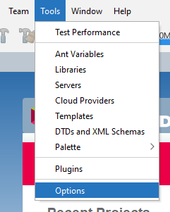
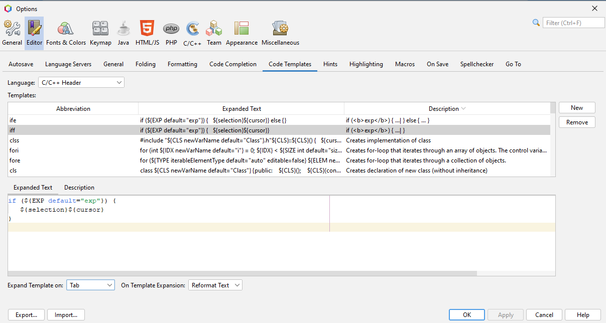

> [!IMPORTANT]
>
> Para que se autocomplete la secuencia, se tiene que presionar la tecla `TAB`,
> después de haber escritro la abreviación.

> [!IMPORTANT]
> Así mismo, también podemos crear nuestros propios atajos de teclado, para escribir
> de forma más rápida, cierto código que deseemos, pero no es recomendable puesto
> que estos no van a ser utiles durante las evaluaciones del curso.

## Copiar y Cortar

Cuando queremos copiar o cortar una sola línea de nuestro código, no es necesario
seleccionarla solo con ejecutar los comando de `Ctrl + C`, `Ctrl + X`; para copiar
o cortar respectivamente toda la línea.

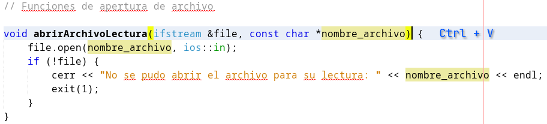

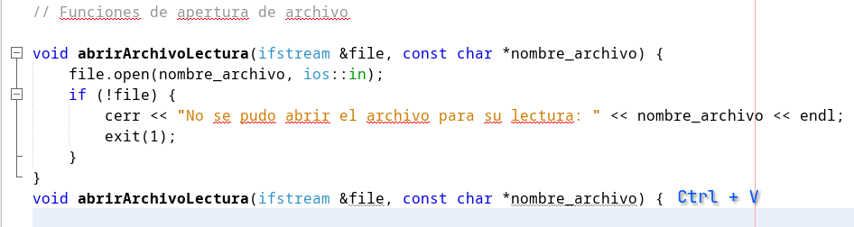

Así mismo, podemos sacar un duplicado de la línea donde esta posicionado nuestro cursor
usando las siguientes combinaciones de teclas:

- `Ctrl + Shift + Up`: La copia arriba de donde esta posicionado nuestro cursor
- `Ctrl + Shift + Down`: La copia abajo de donde esta posicionado nuestro cursor.

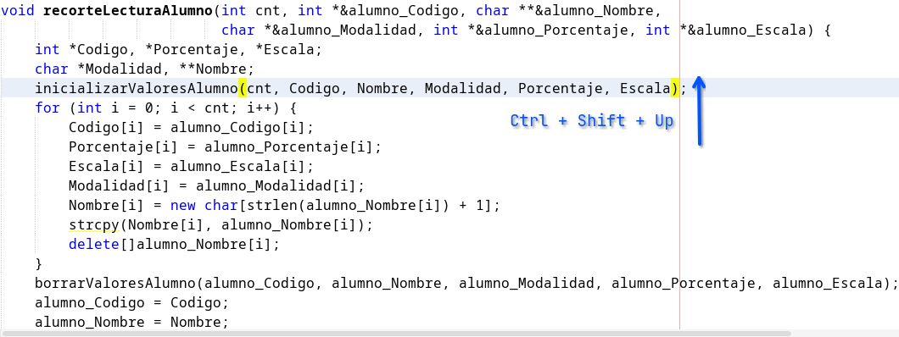

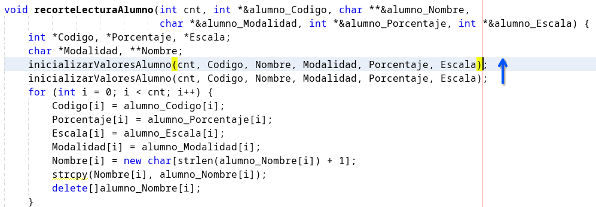

## Mover líneas

Para mover las líneas, de formas sencilla sin tener que hacer uso del mouse, se
puede usar:

- `Alt + Shift + Up`: Mueve la línea hacia arriba.
- `Alt + Shift + Down`: Mueve la línea hacia abajo.

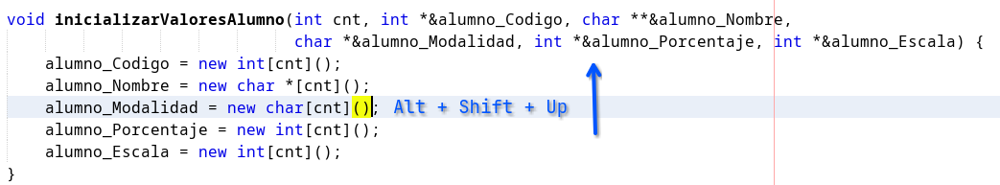

## Salto de línea

Supongamos que estamos agregando una variable a nuestra función, y en vez de
dirgirnos al final de la línea y presionar `Enter`. Para agregar una nueva línea
y poder seguir programando.

Podemos simplemente presionar: `Shift + Enter`, y se no posiciona en la siguiente
línea.

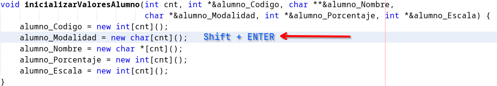
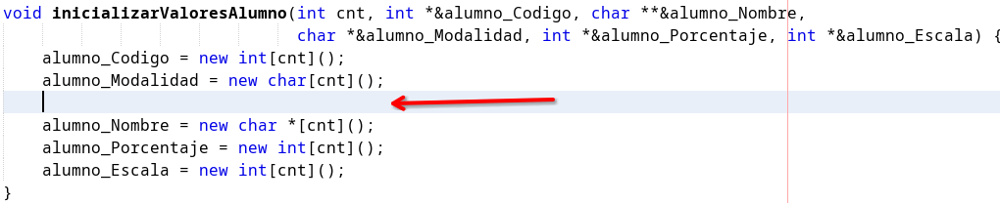

## Comentar Líneas

Para poder comentar y descomentar una línea en `C/C++`, solo deberá de presionar
`Ctrl + Shift + C`; y en caso desees comentar multiples líneas, solo deberá ejecutar
seleccionar las líneas que desea comentar y usando las mismas combinaciones de
teclas se comentarán o descomentarán según usted lo requiera.

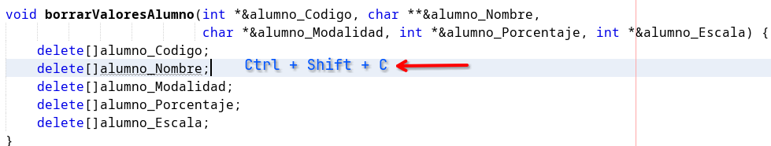
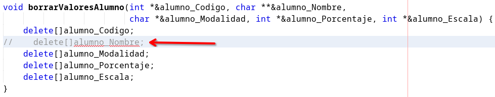

## Eliminar una línea

Para poder eleminar una línea se puede usar `Ctrl + E`; tener en consideración
que esta línea no se está cortando, se está eliminando por lo que no va a poder
usar `Ctrl + V`, para luego insertar en otra parte de nuestro código.

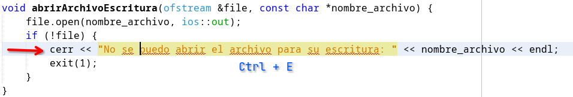
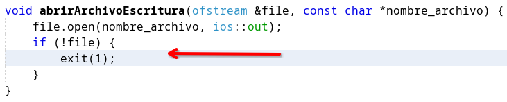

## Conocer los parámetros de una función

Suele ser normal que cuando trabajamos con multiples funciones, se nos pueda olvidar
los parámetros que está va a necesitar, para poder ver los parámetros que esta requiere
colocamos nuestro cursor en medio de los `()` y pulsamos `Ctrl + P`, y nos mostrará
que parámetros necesita, esta ventana se va a quedar activa hasta que terminemos
de agregar todos los parámetros. También sirve para las funciones de las librerías
estándar de `C/CPP`

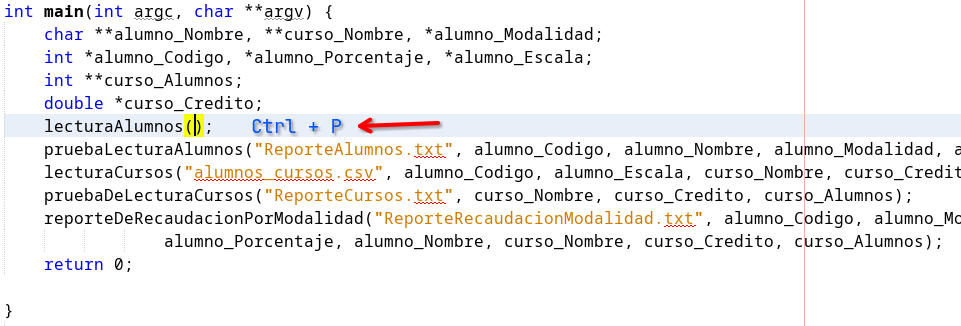
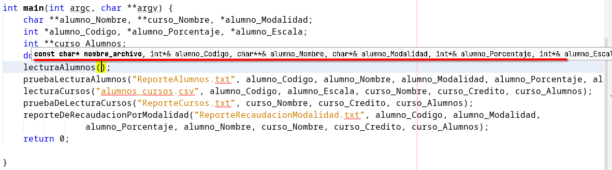

# Atajos de Navegación

Estos atajos nos van a permitir poder navegar de forma más rapida entre nuestro 
código, ahorrando tiempo cuando se tenga que trabajar con multiples archivos `hpp`
y `cpp`.

## Movernos entre archivos

Como ya debe de conocer usando las teclas `Ctrl + TAB` y `Ctrl + Shift + TAB`,
vamos a poder movernos entre los multiples archivos que tengamos abiertos en ese
momento, pero esto no puede ser lo más efectivo. Aquí los atajos más recomendados
para poder movernos.

## Dirigirnos a la declaración de una función o variable

Para movernos a la declaración de una variable o función vamos a tener 2 formas:

- `Ctrl + Click`: En el nombre de la función o variable a la cual queremos dirigirnos.
- `Ctrl + B`: De igual manera, pero el curso tiene que estar sobre el nombre de la variable o función a la cual nos queremos dirigir.

> [!TIP]
> Si volvemos a usar este atajos en el nombre de una función en un archivo `.cpp`,
> nos va a dirigir a su declaración en el archivo `.hpp` donde este fue declarado.

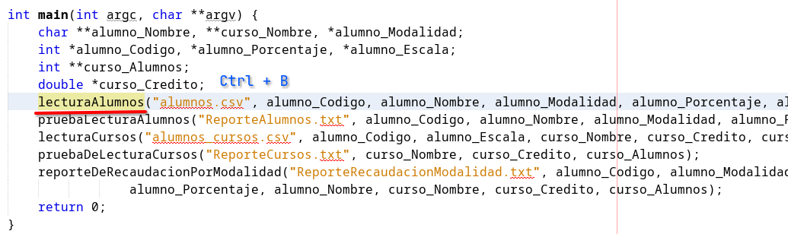
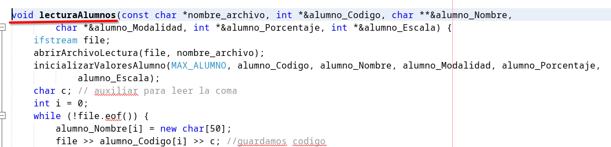

> [!IMPORTANT]
> Si la función todavía no ah sido declarada dentro del archivo `.hpp`, pues los
> comandos, no nos van a poder dirigir a ningún lado, para este caso; podemos
> usar el siguiente comando: `Ctrl + Shift + A`, el cual nos va a dirigir al
> archivo `.hpp`, del mismo nombre que nuestro archivo `.cpp`y vicerversa.

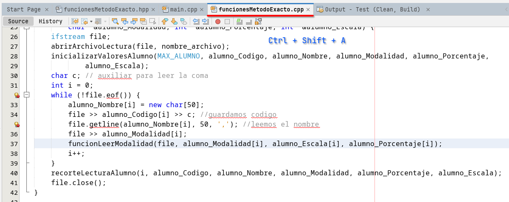
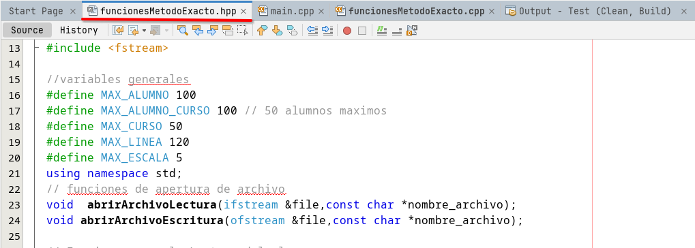

# Atajos de Refactorización

Estos atajos nos va a permitir cambiar el nombre de variables y los parámetros
de una función, existén más opciones de refactorización, pero lamentablemente
no están soportados para `C/CPP`, la mayoría estan pensado para `Java`.

## Cambiar el nombre de una variable

Si queremos cambiar el nombre de una variable, nos vamos a posicionar en el
nobmre de la variable; no es necesario posicionarnos donde esta fue declarada,
y usamos el comando `Ctrl + R`, escribimos el nuevo nombre y cuando ya acabamos
presionamos `ESC`.

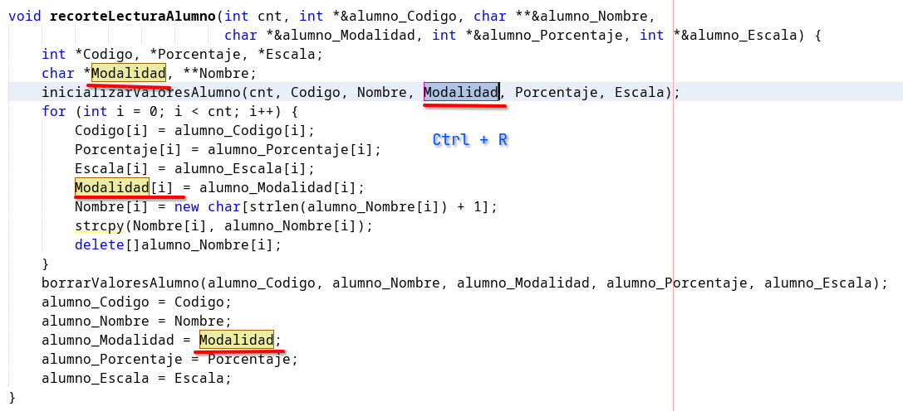
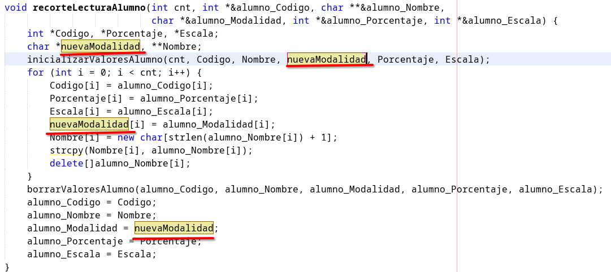

## Cambiar los parámetros de una función

Para cambiar los parámetros de la función, nos posicionamos en cualquier parte
de la función; de preferencia sobre su nombre, y con las teclas
`Ctrl + Alt + Shift + C`, nos aparecerá la siguiente ventana, donde podemos
ingresar las nuevas variables, su tipo y valor por defecto en caso sea necesario.
La ventaja de esta funcionalidad respecto a escribir manualmente las nuevas variables,
es que cuando ya tenemos la función declarada en nuestro archivo `.hpp`, aquí
también se vera actualizado.

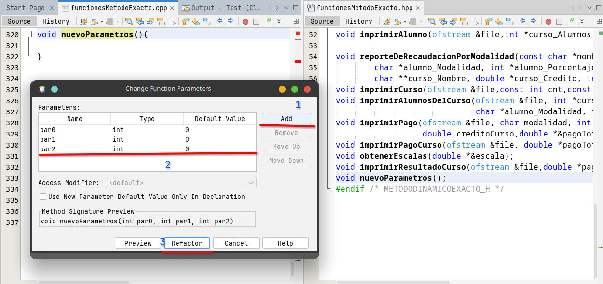
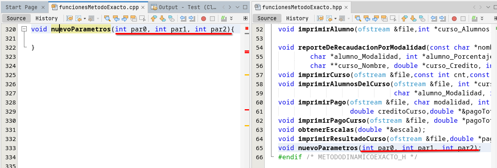

> [!IMPORTANT]
> Si primero agregamos las variables a la función manualmente y luego lo intentamos
> refactorizar, no se verá ningún cambio en el archivo `.hpp`.

