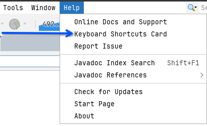
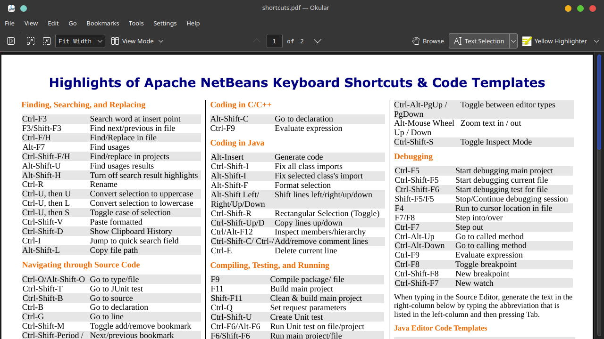

<h1> Atajos de Teclado </h1>

El propio entor de NetBeans, nos ofrece un pdf con sus atajos de teclado más sencillos,
para poder hacer a esto, tenemos que ir a:

> Help > Keyboard Shortcuts Card

Y esto nos debería de abrir el siguienye pdf:

Un problema con el siguiente pdf, es que algunos de los atajos solo son utilizables
cuando se programa en el lenguaje de programación Java, o simplemente no están implementados.

Por lo tanto, voy a dividir los atajos de teclado bajo el siguiente orden:

- Atajos de Codificacion
- Atajos de Navegacion
- Atajos de Refactorizacion

## Atajos de Codificación

