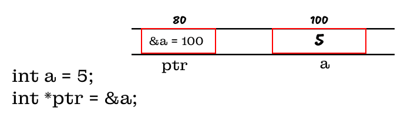
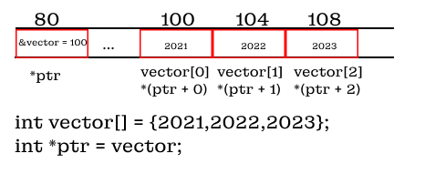
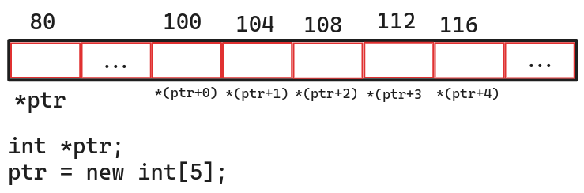
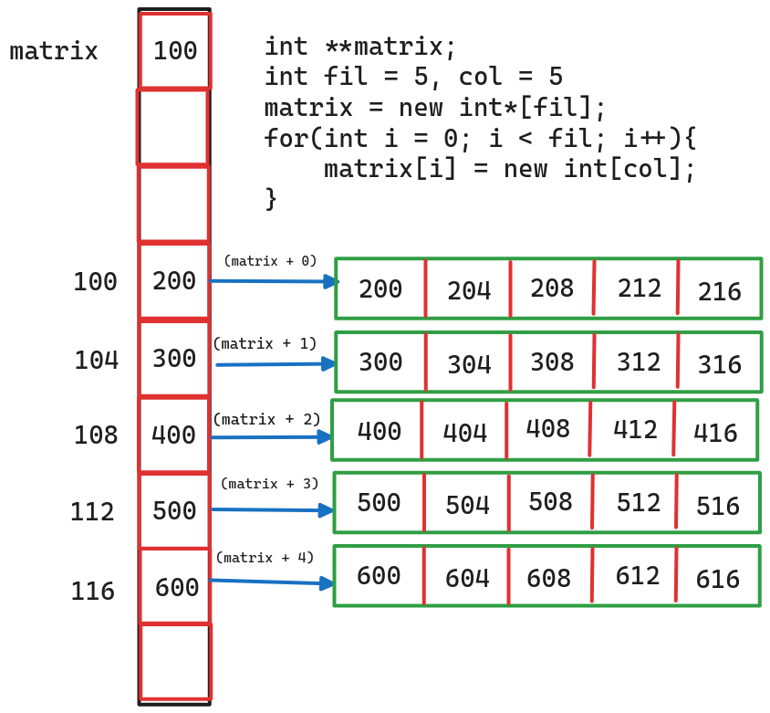
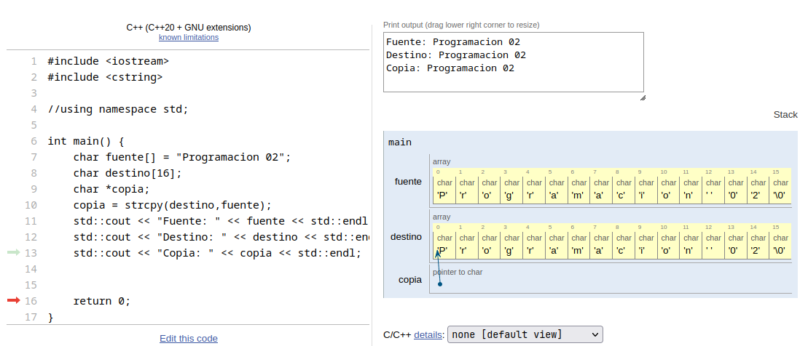

# Punteros

- [Punteros](#punteros)
- [Introducción](#introducción)
- [Punteros y Memoria](#punteros-y-memoria)
  - [Ventajas](#ventajas)
  - [Desventajas](#desventajas)
  - [Declaración de punteros](#declaración-de-punteros)
  - [Operaciones de dirección](#operaciones-de-dirección)
  - [Desreferenciación de un puntero mediante el operador de indirección](#desreferenciación-de-un-puntero-mediante-el-operador-de-indirección)
  - [Operaciones con punteros](#operaciones-con-punteros)
    - [Aritmética de punteros](#aritmética-de-punteros)
  - [Uso de los punteros](#uso-de-los-punteros)
  - [Concepto de `NULL`](#concepto-de-null)
  - [Concepto de `nullptr`](#concepto-de-nullptr)
- [Manejo de la memoría dinámica en C/C++](#manejo-de-la-memoría-dinámica-en-cc)
  - [Funciones para la asignación de memoria](#funciones-para-la-asignación-de-memoria)
  - [New](#new)
  - [Delete](#delete)
- [Memoria Stack and Heap](#memoria-stack-and-heap)
  - [Memoría Stack](#memoría-stack)
  - [Memoría Heap](#memoría-heap)
- [Pointers and Arrays](#pointers-and-arrays)
  - [Resumen de Array](#resumen-de-array)
    - [Array unidimensional](#array-unidimensional)
    - [Array bidimensional](#array-bidimensional)
    - [Array multidimensional](#array-multidimensional)
  - [Notación de punteros y arrays](#notación-de-punteros-y-arrays)
  - [Diferencia entre array y pointer](#diferencia-entre-array-y-pointer)
  - [Crear un array unidimensional](#crear-un-array-unidimensional)
  - [Array de punteros](#array-de-punteros)
    - [Explicación de la notación de punteros](#explicación-de-la-notación-de-punteros)
  - [Punteros y arrays multidimensionales](#punteros-y-arrays-multidimensionales)
- [Pointers and Strings](#pointers-and-strings)
  - [Fundamentos de String](#fundamentos-de-string)
  - [Inicialización de String](#inicialización-de-string)
  - [Operaciones con string](#operaciones-con-string)
    - [Longitud de un string](#longitud-de-un-string)
    - [Comparamos strings](#comparamos-strings)
    - [Copiar un string](#copiar-un-string)
    - [Concatenar un string](#concatenar-un-string)
    - [Examinar un string](#examinar-un-string)
    - [Convertir string a formato numerico](#convertir-string-a-formato-numerico)
- [Pointers and Structures](#pointers-and-structures)
- [Puntero `void`](#puntero-void)
  - [Casteo de una variable](#casteo-de-una-variable)
    - [Casting tradicional](#casting-tradicional)
    - [static\_cast](#static_cast)
    - [dynamic\_cast](#dynamic_cast)
    - [const\_cast](#const_cast)
    - [reinterpret\_cast](#reinterpret_cast)

# Introducción 

La definición más elementar de un puntero, es una variable, que puede almacenar
la dirección de una posición de memoria, y para poder comprender mejor esto debemos
de conocer primero como se gestiona la memoria en un programa en C++.

# Punteros y Memoria

Al momento de compilar un programa en C++, este trabaja con 3 tipos de memoria.

<h2> Estática/Global </h2>

Las variables declaradas estaticamente o globalmente, pertenecen al mismo
bloque de memoria; durando toda la ejecución del programa.
Siendo su diferencia, que se puede tener acceso a las variables globales en cualquier
momento y en cualquier función; en cambio, las estáticas se limitan a la función
que las define.

<h2> Automatica </h2>

Estas son las variables declaradas dentro de una función cuando esta es llamada;
por lo tanto su tiempo de ejecución también es el tiempo de ejecución de la función.

<h2> Dinámica </h2>

Espacio de la memoria de a la cual se puede asignar un puntero, donde este hace
referencia a la memoria, y existiendo hasta que uno la libere.

|            | Alcance                        | Tiempo de vida                               |
| ---------- | ------------------------------ | -------------------------------------------- |
| Global     | Todo el archivo                | Todo el tiempo de ejecución de la aplicación |
| Estático   | Cuando la función es declarada | Todo el tiempo de ejecución de la aplicación |
| Automática | Cuando la función es declarada | El tiempo de ejecución de la función         |
| Dinámica   | Determinada por los punteros   | Hasta que la memoria sea liberada            |

## Ventajas

Como los punteros son capaces de almacenar las direcciones de memoria, significa
que están más cerca del lenguaje máquina; logrando que el tiempo de compilación
sea más rápido, que otros operadores.

También, la representación de las `estructuras de datos` se pueden trabajar más
facilmente con los punteros.

## Desventajas

Una desventaja del uso de los punteros, es el uso de expresiones compactas, las 
cuales no suelen muy descriptivas de lo que se está realizando; asiendo que el programador
tenga que ir decifrando.s

```CPP
char *names[] = {"Hello","Jesus","Huayhua"};
// Notación de punteros
std::cout << *(*(names+1)+2) << std::endl;
// Notación de array
std::cout << names[1][2] << std::endl;
```
Otras desventas que se presentan al momento de usar los punteros y no se tenga
un entendimiento correcto de su funcinamiento:

- Acceder a información más allá de sus límites.
- Hacer referencia a variables cuando ya no existan.
- Hacer referencia a memoria que anteriormente a sido liberada.
- Desreferenciar a un puntero antes de que se haya asignado memoria.
## Declaración de punteros

La declaración de un puntero es sencillo, solo se tiene definir el `tipo de variable`
que se desea tener como puntero seguido de un `*`.

```CPP
int num; // Variable
// Cualquiera de las siguientes formas es valida para declarar un puntero
int*ptr1;
int* ptr2;
int *ptr3;
int * ptr4;
```
> Un puntero, solo va a hacer referencia al mismo tipo que fue declarado en un principio

## Operaciones de dirección

El operador `&`, nos devuelve la dirección de memoria de una variable. Por lo tanto,
se utiliza para inicializar los punteros.

```CPP
int num = 0; // Variable
int *ptr = &num;

// Error compiler
int num = 0;
int *ptr;
ptr = num;
```


> Recordar:
>
> Los punteros almacenan direcciones de memoria

Convertir un entero a un puntero:

```CPP
int num = 0;
int *ptr = &num;
ptr = (int *)num;
```

> Esto sirve para cualquier tipo de variable 

## Desreferenciación de un puntero mediante el operador de indirección

El operador de indirección `*`, este nos devuelve al valor al que apunta un puntero;
y es este proceso que se le conoce como referido o desreferenciar un puntero.

```CPP
int num = 5;
int *ptr = &num;

std::cout << "Su valor es: " << *ptr <<std::endl; // 5
```

Este mismo procedimiento es que se utiliza, para hacer cambios a la variable a la
cual hace referencia.

```CPP
int num = 0;
int *ptr = &num;

*ptr = 200;

std::cout << "La dirección de memoria es: " << &num // 0x7ffc11d03bec
          << ", su valor es: " << num <<std::endl;  // 200
std::cout << "La dirección de memoria es: " << &ptr // 0x7ffc11d03bf0
          << ", su valor es: " << ptr <<std::endl;  //0x77ffc11d03bec
```
## Operaciones con punteros

| Operador                 | Nombre                                                                 | Significado                                                    |
| ------------------------ | ---------------------------------------------------------------------- | -------------------------------------------------------------- |
| *                        |                                                                        | Usado para declarar punteros                                   |
| *                        | Dereferenciar                                                          | Usado para dereferenciar un puntero                            |
| ->                       | Point-to(apuntar a)                                                    | Acceder a campos de una estructura referenciada por un puntero |
| +                        | Adición                                                                | Usado para incrementar un puntero                              |
| -                        | Subtracción                                                            | Usado para decrementar un puntero                              |
| == !=                    | Igualdad y desiguladad                                                 | Comparar 2 punteros                                            |
| > <br> >= <br> < <br> <= | Menor que <br> menor o igual que <br> Mayor que <br> Mayor o igual que | Comparar 2 punteros                                            |
| (data type)              | Cast(caster o casteo)                                                  | Cambiar el tipo del puntero                                    |

### Aritmética de punteros

1. Añadir un entero a un puntero

Cuando se añade un entero a un puntero, lo que se hace es incrementar en `bits`
el tamaño de la dirección de memoria, es relación al tipo de la variable que se
este sumando.

```CPP
// Ejemplo 1
int vector[] = {2021,2022,2023};
int *ptr = vector;

std::cout << "Ptr: " << *ptr<<std::endl; // 2021
ptr += 1;
std::cout << "Ptr: " << *ptr<<std::endl; // 2022
ptr += 1;
std::cout << "Ptr: " << *ptr<<std::endl; // 2023
// Tambien podemos usar el sizeof() para indicar la cantidad a incrementar
// Ejemplo 2
int vector[] = {2021,2022,2024,2025,2026,2027,2028,2029,2030,2031,2032,2033};
int *ptr = vector;
double a = 1;

std::cout << "Ptr: " << *ptr<<std::endl; // 2021
ptr += sizeof(double); //Otra forma ptr += sizeof(a);
std::cout << "Ptr: " << *ptr<<std::endl; // 2030
```

1. Sustraer un entero a un puntero

De forma similar, al restar un entereo a un puntero, este se decrementa en la
misma cantidad de `bits` del tipo de variable que se este rezando.

```CPP
// Ejemplo 1
int vector[] = {2021,2022,2023};
int *ptr = vector + 2;

std::cout << "Ptr: " << *ptr<<std::endl; // 2023
ptr--;
std::cout << "Ptr: " << *ptr<<std::endl; // 2022
ptr--;
std::cout << "Ptr: " << *ptr<<std::endl; // 2021
// Tambien podemos usar el sizeof() para indicar la cantidad a incrementar
// Ejemplo 2
int vector[] = {2021,2022,2024,2025,2026,2027,2028,2029,2030,2031,2032,2033};
int *ptr = vector + 8;
std::cout << "Ptr: " << *ptr<<std::endl;  // 2030
ptr -= sizeof(double); //Otra forma ptr -= sizeof(a);
std::cout << "Ptr: " << *ptr<<std::endl; // 2021
```

3. Sustraer 2 punteros entre sí

Cuando se retar 2 punteros entre sí, en sí se están restando las direcciones de memoria
que tiene almacenada; No el valor de al cual hace referencia dicha dirección de memoria.

```CPP

int vector[] = {47,20,7};
int *p0 = vector;
int *p1 = vector + 1;
int *p2 = vector + 2;
std::cout << " P2 - P0 " << p2 - p0 << std::endl; // 2
std::cout << " P2 - P1 " << p2 - p1 << std::endl; // 1
std::cout << " P0 - P1 " << p0 - p1 << std::endl; // -1
```

Para poder restar el valor al cual esa referencia la dirección de memoria que tiene
almacenanda, tenemoes que hacer dereferenciarlo.

```CPP
std::cout << " P2 - P0 " << *p2 - *p0 << std::endl; // -40
```

4. Comparar punteros

Los mismo al comprar punteros, lo que se realiza es la comparación de las
direcciones de memoria que tengan almacenada, y para comparar el valor al cual
hace referencia dicha dirección, se tiene que dereferenciar, para obtener el
valor.

```CPP
int vector[] = {1,2,3,4,5,6,7};
int *p1 = vector;
int *p2 = vector + 1;

if(*p1 < *p2){ // 1 < 2
  // ...
}
```



## Uso de los punteros

Tenemos 2 usos principales de los punteros:

- Nivel de indirección

Si diseamos apuntar a un puntero, este tiene que ser unicamente 1 nivel superior al que tenga
dicho puntero, al que deseamos apuntar.

Los niveles en los punteros están relacionados la cantidad de `*` al momento de ser
declarado:

```CPP
int a;    //Nivel 0
int *b    //Nivel 1
int **c;  //Nivel 2
int ***d; //Nivel 3
int ****e;//Nivel 4

b = &a;
c = &b;
d = &c;
// Error compiler
// d = &a;
```
## Concepto de `NULL`

El concepto de `NULL` para un puntero, es cuando este hace referencia a ningún valor.
La idea es que el puntero, apunte a un valor especial donde solo es igual a otro puntero
que también apunte a dicho valor.

La macro, para el puntero `NULL` es una constante entera convertida a un puntero void:

```CPP
#define NULL ((void *)0)
```
Ahora si bien se puede utilizar el `0` para representar el valor de `NULL`, este
puede genera confunsión; por lo que, no es recomendable usarlo.

```CPP
int num;
int *p = 0; // Pointer NULL

p = &num;
p = 0; // Referencia al valor de tipo int
```
Pero también se puede usar el `NULL`, como valor `0`.

```CPP
int num = NULL + 10;
std::cout << num << std::endl; // 10
```

El compilador nos indicará que se esta usando el `NULL`, en una operación
aritmética.

> NULL used in arithmetic

## Concepto de `nullptr`

Como puede existe, errores al momento de trabajar con el valor de `NULL`, 
en C++ se implemento el **Null pointer constant**, funciona de forma similar al 
`NULL`, solo que este al ya no ser una macro, el compilador utilizará otras instrucciones
máquinas, para indicar que el puntero esta apuntado a la nada.

```CPP
char *pc = nullptr;  //OK 
int  *pi = nullptr;  //OK
bool   c = nullptr;  //OK. c is false
int    i = nullptr;  //error
```

# Manejo de la memoría dinámica en C/C++

En C/C++, al ser lenguajes de bajo nivel, podemos gestionar la memoria del computador
y como los punteros son quienes nos permite interactuar con esta; son ellos los que
más se benefician de poder manejar la memoría del computador.

Lo pasos más básicos del manejo la memoria en `C/C++` es:

- Usar `new` para asignar espacio de memoria.
- Usar la memoria para soportar aplicaciones.
- Liberar la memoria asignada con la función `delete`.

```CPP
int cant = 5;
int *ptr = new int;

char *pc = new char[6];

for(int i = 0; i < 6; i++){
  *pc[i] = 0;
}
```

Al momento de realizar la función `new` en el mismo puntero, la memoria
anteriormente asignada, no se libera, se queda en el `heap` de la memoria del programa,
por lo cual, esta memoria se va a ir almacenando y como dicha memoria no se puede
volver asignar a ninguna otra variables esta hace que se sobrecarga.

La memoria perdida, ya no puede volver a ser localizada porque no conocemos la 
dirección de memoria de la asignación anterior.

## Funciones para la asignación de memoria

En `C++` contamos con las siguientes funciones para la asignación de memoria:

| Función  | Descripción                             |
| -------- | --------------------------------------- |
| `new`    | Asigna la memoria en el *heap*          |
| `delete` | Libera la memoria asignada en el *heap* |

## New

La palabra clave `new`, nos permite asignar me memoria al puntero al cual hacemos referencia.

```CPP
// <type> <nombre> = new <type>(<value>)
int a = new int(5); 
std::cout << a << std::endl; // a = 5
// <type> <nombre> = new <type>[<value>]
int *ptr = new int[5];
```

Tanto si le asignamos un núevo valor, o como si le asignamos multiples valores,
está nueva memória será asignada en el `heap` de la memoría.

## Delete

La función `delete` nos ayuda a liberar la memoría asignada en el `heap` de la memoría RAM.

```CPP
// delete <nombre>;  si se asigno un único valor
delete a;
// delete[] <nombre>;  si se asigno varios valores
delete[] ptr;
ptr = nullptr;
```

> Se remocienda después de usar el delete, que el puntero apunte a `nullptr`.

# Memoria Stack and Heap

No voy a explicar el como funciona la memoría de un computador y todas las partes
que lo dividen; pero sí de las partes más importantes que están en relación con la
memoría `RAM` y los `punteros`:

- *Stack* 
- *Heap*

## Memoría Stack

Esta parte de la memoría es definida por nuestro sistema operativo cuando se
ejecuta un programa, por lo que, su espacio limitado y si en caso llegemos a 
sobre pasar dicho espacio estaremos en el problema conocido como *Stack Overflow*.

Es en esta memoría donde también se van almacenando las funciones y las variables
que la componen.

> No se abordará en esta parte el concepto de que es una función, solo tener
> en cuenta es que son partes del código que se puede llamar en cualquier momento.

Supongamos que tenemos definidas cierta función en el fichero `Foo`.
```CPP
#include <iostream>
#include "Foo"

int main(){
  int num;
  num = foo();
  std::cout << num << std::endl;
  int num2;
  num2 = foo2();
  std::cout << num2 << std::endl;
  return 0;
}
```

Graficamente el funcionamiento de la memoría `Stack`, se vería de la siguiente manera:


1. Se ejecuta el programa, y se aloja en la memoría el función *main*

2. Se llama a la función *foo()*, por lo que se apila en la memoría, y se empieza a ejecutar

3. Una vez terminado, se elimina automaticamente de la memoría, y se retorna a la 
ejecución de la función main.

1. De la misma forma para la función *foo2()*

2. Se termina de ejecutar el programa, y *main()* también es eliminada de la memoría.

> Recordar que las variables asociadas a cierta función, solo van a funcionar dentro de la misma función
> no puede ser usada en otra función, para nuestro ejemplo la función *foo()* ni *foo2()*,
> pueden hacer uso de las variables de la función *main()*. 
## Memoría Heap

A diferencia de la memória `Stack`, la `Heap` no tiene un espacio determinado, sino
que va creciendo conforme vayamos necesitando; por lo que es muy usado para almacenar
strucutras con grandes porciones de datos.

Es justo en esta parte de la memoría, donde van a estar apuntado los punteros
que definamos; puesto que, solo podemos acceder a ella con los punteros.

Tener en consideración, que cuando se asigne memoría con `new` no se verá eliminada
en ningún momento, a menos que la eliminemos manualmente con la función `delete`.
Incluso si la función que donde fue asignada ya fue eliminada del `Stack`.


Por lo tanto, siempre se va a tener cuidado con la asignación de memoría a un puntero;
porque si el puntero apunta a un nuevo valor, y no se liberó anteriormente
esa porción se quedará activa en la memoría y sin forma que podamos acceder a ella nuevamente.

```CPP
int *ptr = new int[5];// Se le asigna memoria
int num = 5;
ptr =  &num; // Ya perdimos la información de la memoría que se le asigno originalmente
```
> [!IMPORTANT]
> Si desean ver graficamente aquí una [página web](https://pythontutor.com/visualize.html#mode=edit)


# Pointers and Arrays

El array, es la estructura de datos más fundamental que existe en C/C++.

Los arrays y punteros son distintos, si bien podemos hacer uso de la notación
de los array en punteros, y trabajar los arrays como si fueran punteros, veremos
que esto es incorrecto, y cada uno tiene su propia notación.

## Resumen de Array

### Array unidimensional

Los array son estructura de datos, sencillas que nos permite almacenar datos
de un mismo tipo de valor, y si se ve desde la memoria, estos son almacenados
continuamente, sin ningún bit de separación; y podemos acceder a ellos con un index.


```CPP
// Sintaxis:
// <tipo-de-dato> nombre[CANTIDAD DE DATOS];
// Otra forma
//             0, 1, 2
int array[] = {10,20,30};
```

> Recordar: cualquier tipo de array empieza su `index` con *0*
 
### Array bidimensional

También contamos con matrices de multiples dimensiones, siendo la más común la
bidimensional; siendo representada por filas y columnas;


> C/C++ va a almacenar los arrays dimensionales, donde primero van todos los valores
> de la pimera fila, y luego la siguiente, hasta que se acaben las filas
> 
> Al igual que no debemos de confundir un array con un puntero.
> Tampoco se tiene que confundir un array bidimensional con una matriz de punteros.

### Array multidimensional

Podemos tener array de multiples dimensiones, aunque estos no lleguen a ser muy
ususados.

```CPP
int arr3d[filas][columnas][profundidad] = {
  {{1,2,3,4},{5,6,7,8}},
  {{9,10,11,12},{13,14,15,16}},
  {{17,18,19,20},{21,22,23,24}}
};
```

<details>
<summary> Output </summary>
<code>
arr3d[0][0][1] = 1;<br>
arr3d[0][0][2] = 2;<br>
arr3d[0][0][3] = 3;<br>
arr3d[0][0][4] = 4;<br>
arr3d[0][1][0] = 5;<br>
arr3d[0][1][1] = 6;<br>
arr3d[0][1][2] = 7;<br>
arr3d[0][1][3] = 8;<br>
....<br>
arr3d[2][1][3] = 24;<br>
</code>
</details>

## Notación de punteros y arrays

```CPP
int vector[5] = {1,2,3,4,5};
int *ptr = vector;

std::cout << "Notacion de array\n";
for (int i = 0; i < 5; i++){
  std::cout << vector[i];
}
std::cout << "\n";

std::cout << "Notacion de punteros\n";
for (int i = 0; i < 5; i++){
  std::cout << *(ptr + i);
}
std::cout << "\n";
```

<details>
<summary> Output </summary>
<pre>
<code>
Notacion de array
12345
Notacion de punteros
12345
</code>
</pre>
</details>

> Nota: tener cuidado con la notación de los punteros porque nos podemos ir más
> alla de los límites del array y estaríamos recogiendo la basura del sistema.

## Diferencia entre array y pointer

Las diferencia más clara la podemos encontrar en como el compilador ejecuta el código
máquina respecto a ambos.

- `array`: Generá código máquina que se mueve `i` posiciones desde la ubicación
del vector y usa su contenido
- `pointer`: Generá código máquina que incrementa la dirección de memoría del vecotr
en `i`, y usa el contenido en dicha dirección

> El resultado es el mismo, pero como lo trabaja el compilador es distinto

## Crear un array unidimensional

Para poder crear un array, se utilizará la función `new`.

```CPP
int *vector = new int[5];
```



> No olvidar liberar la memoría asignada cuando ya no se necesite.


## Array de punteros

<!-- agregar imagen -->

```CPP
// Notación de array
int *arr[5];
for (int i = 0; i < 5; i++) {
   arr[i] = new int;
   *arr[i] = i + 1;
}

for (int i = 0; i < 5; i++) {
   std::cout << *arr[i] << " ";
}

// Notación de punteros
int *arr[5];
for(int i = 0; i < 5 , i++){
  *(arr + i) = new int;
  **(arr + i) = i + 1;
}

for(int i = 0; i < 5 , i++){
  std::cout << **(arr + i) << " ";
}
```
### Explicación de la notación de punteros

- `arr`: Es la dirección de memoría de la variable
- `arr + i`: Es la dirección de memoría, incrementado en i veces
- `*arr`: Es la dirección de memoría que tiene almacenado, o dicho de otro modo a la que apunta
- `**arr`: Es es valor de que tiene almacenado, la dirección de memoría almacenado por el puntero

## Punteros y arrays multidimensionales

Siguiendo la idea de lo explicado anteriormente, podemos hacer que un puntero del
array de punteros apunte array, asignandole memória dinámica.

Con punteros

```CPP
// Notación de punteros
int **matrix;
int value = 1,
filas = 2,
columnas = 5;
matrix = new int *[filas];
for (int i = 0; i < filas; i++) {
     *(matrix + i) = new int[columnas];
    for (int j = 0; j < columnas; j++) {
        *(*(matrix + i) + j) = value++;
    }
}

for (int i = 0; i <filas; i++){
  for(int j = 0 ; j < columnas; j++){
    std::cout << "Matrix[" << i << "][" << j << "] Address: " << (*(matrix + i) + j) << " Value: " <<  *(*(matrix + i) + j) << std::endl;
  }
}
```
<details>
<summary> Output </summary>
<code>
matrix[0][0] Address: 007B7F10 Value: 1<br>
matrix[0][1] Address: 007B7F14 Value: 2<br>
matrix[0][2] Address: 007B7F18 Value: 3<br>
matrix[0][3] Address: 007B7F1C Value: 4<br>
matrix[0][4] Address: 007B7F20 Value: 5<br>
matrix[1][0] Address: 007B7F30 Value: 6<br>
matrix[1][1] Address: 007B7F34 Value: 7<br>
matrix[1][2] Address: 007B7F38 Value: 8<br>
matrix[1][3] Address: 007B7F3C Value: 9<br>
matrix[1][4] Address: 007B7F40 Value: 10
</code>
</details>
<br>
Esto es similar, si hicieramos lo siguiente con los array:

```CPP
// Notación de array
int matrix[2][5] ={
  {1,2,3,4,5},
  {6,7,8,9,10}
};

for (int i = 0; i <2; i++){
  for(int j = 0 ; j < 5; j++){
    std::cout << "matrix[" << i << "][" << j << "] Address: " << &matrix[i][j] << " Value: " << matrix[i][j] << std::endl;
  }
}
```



> La ventaja, es que podemos modificar el array de punteros, de acuerdo a lo solicitado
> por un usuario, en cambio con array vamos a tener algo predefinido, que no se puede
> variar.

```CPP
// Para array de tridimensional
int ***matrix3D;
int fil = 5, col = 5, profundidad = 2,value = 0;

matrix3D = new int**[fil];

for (int i = 0; i < fil; i++) {
   *(matrix3D + i) = new int*[col];
    for (int j = 0; j < col; j++) {
        *(*(matrix3D + i) + j) = new int[profundidad];
        for (int k = 0; k < profundidad; k++) {
            *(*(*(matrix3D + i) + j) + k) = value;
            value++;
        }
    }
}

for (int i = 0; i < fil; i++) {
    for (int j = 0; j < col; j++) {
        for (int k = 0; k < profundidad; k++) {
            std::cout << "matrix[" << i << "][" << j << "][" << k
            << "] Address: " << (*(*(matrix3D + i) + j) + k)
            << " Value: " << *(*(*(matrix3D + i) + j) + k) << std::endl;
        }
    }
}
```

<details>
<summary> Output </summary>
<code>
matrix[0][0][0] Address: 007B7AE8 Value: 1<br>
matrix[0][0][1] Address: 007B7AEC Value: 2<br>
matrix[0][1][0] Address: 007B7AF8 Value: 3<br>
matrix[0][1][1] Address: 007B7AFC Value: 4<br>
matrix[0][2][0] Address: 007B7B08 Value: 5<br>
matrix[0][2][1] Address: 007B7B0C Value: 6<br>
matrix[0][3][0] Address: 007B7B18 Value: 7<br>
matrix[0][3][1] Address: 007B7B1C Value: 8<br>
matrix[0][4][0] Address: 007B7B28 Value: 9<br>
matrix[0][4][1] Address: 007B7B2C Value: 10<br>
matrix[1][0][0] Address: 007B7B58 Value: 11<br>
matrix[1][0][1] Address: 007B7B5C Value: 12<br>
matrix[1][1][0] Address: 007B7B68 Value: 13<br>
matrix[1][1][1] Address: 007B7B6C Value: 14<br>
matrix[1][2][0] Address: 007B7B78 Value: 15<br>
matrix[1][2][1] Address: 007B7B7C Value: 16<br>
matrix[1][3][0] Address: 007B7B88 Value: 17<br>
matrix[1][3][1] Address: 007B7B8C Value: 18<br>
matrix[1][4][0] Address: 007B7B98 Value: 19<br>
matrix[1][4][1] Address: 007B7B9C Value: 20<br>
matrix[2][0][0] Address: 007B7BC8 Value: 21<br>
matrix[2][0][1] Address: 007B7BCC Value: 22<br>
matrix[2][1][0] Address: 007B7BD8 Value: 23<br>
matrix[2][1][1] Address: 007B7BDC Value: 24<br>
matrix[2][2][0] Address: 007B7BE8 Value: 25<br>
matrix[2][2][1] Address: 007B7BEC Value: 26<br>
matrix[2][3][0] Address: 007B7BF8 Value: 27<br>
matrix[2][3][1] Address: 007B7BFC Value: 28<br>
matrix[2][4][0] Address: 007B7C08 Value: 29<br>
matrix[2][4][1] Address: 007B7C0C Value: 30<br>
matrix[3][0][0] Address: 007B7C38 Value: 31<br>
matrix[3][0][1] Address: 007B7C3C Value: 32<br>
matrix[3][1][0] Address: 007BBF20 Value: 33<br>
matrix[3][1][1] Address: 007BBF24 Value: 34<br>
matrix[3][2][0] Address: 007B7E10 Value: 35<br>
matrix[3][2][1] Address: 007B7E14 Value: 36<br>
matrix[3][3][0] Address: 007B7D60 Value: 37<br>
matrix[3][3][1] Address: 007B7D64 Value: 38<br>
matrix[3][4][0] Address: 007B7D40 Value: 39<br>
matrix[3][4][1] Address: 007B7D44 Value: 40<br>
matrix[4][0][0] Address: 007B7DC0 Value: 41<br>
matrix[4][0][1] Address: 007B7DC4 Value: 42<br>
matrix[4][1][0] Address: 007B7E40 Value: 43<br>
matrix[4][1][1] Address: 007B7E44 Value: 44<br>
matrix[4][2][0] Address: 007B7CF0 Value: 45<br>
matrix[4][2][1] Address: 007B7CF4 Value: 46<br>
matrix[4][3][0] Address: 007B7DD0 Value: 47<br>
matrix[4][3][1] Address: 007B7DD4 Value: 48<br>
matrix[4][4][0] Address: 007B7D20 Value: 49<br>
matrix[4][4][1] Address: 007B7D24 Value: 50<br>
</code>
</details>
<br>


Un problema con este tipo de asignación, es que la memoria no es continua,
en el sentido que la dirección de memoria usada por fila del array de punteros,
apunta a una sección distinta de la memoria del sistema. Pero se puede solucionar
si se trabaja con los punteors, de la siguiente manera:

```CPP
int filas = 2;
int columnas = 5;
int value = 1;
// creación de la matriz bidimensional.
int **matrix = new int*[filas];
matrix[0] = new int[filas * columnas];

for (int i = 1; i < filas; i++)
    matrix[i] = matrix[0] + i * columnas;

// asignación de valor
for (int i = 0; i < filas; i++) {
    for (int j = 0; j < columnas; j++) {
        *(*(matrix + i) + j) = value++;
    }
}
// impresión
for (int i = 0; i < filas; i++) {
    for (int j = 0; j < columnas; j++) {
        std::cout << "maxContinue[" << i << "][" << j << "] Address: " << (*(matrix + i) + j) << " Value: " << *(*(matrix + i) + j) << std::endl;
    }
}
```
<details>
<summary> Output </summary>
<code>
maxContinue[0][0] Address: 00F6BF30 Value: 1<br>
maxContinue[0][1] Address: 00F6BF34 Value: 2<br>
maxContinue[0][2] Address: 00F6BF38 Value: 3<br>
maxContinue[0][3] Address: 00F6BF3C Value: 4<br>
maxContinue[0][4] Address: 00F6BF40 Value: 5<br>
maxContinue[1][0] Address: 00F6BF44 Value: 6<br>
maxContinue[1][1] Address: 00F6BF48 Value: 7<br>
maxContinue[1][2] Address: 00F6BF4C Value: 8<br>
maxContinue[1][3] Address: 00F6BF50 Value: 9<br>
maxContinue[1][4] Address: 00F6BF54 Value: 10<br>
</code>
</details>
<br>


# Pointers and Strings

> [!IMPORTANT]
> Desde la versión de `C++98` se agregó el tipo de variable `string`, con el cual
> facilita el estar manejando string con punteros; pero por fines académicos
> estos no se podrán utilizar en el tema de punteros.
<!-- VERIFICAR A PARTIR DE QUE TEMA SE PERMITE LA REALIZACION DE ESTE TEMA-->

Los `strings` van a ser utilizados habitualmente para realizar operaciones con
cadenas de texto(array de tipo char), y con los punteros vamos a poder
asignar memoría dinámicamente y el paso de las cadenas a funciones
para su uso.

## Fundamentos de String

Los `strings` es una secuencia de caracteres que siempre termina con el caracter
ASCII NUL, el cual es representado por `\0`

> [!IMPORTANT]
> Recorar que `NULL` y `NUL` son diferentes.
> - `NULL`: es usado en punteros definido como: `((void*)0)`.
> - `NUL`: es un caracter definido como `\0`, el cual nos representar el final de un string.

## Inicialización de String

La inicialización de los `string`, se admiten de 3 formas:

```CPP
// Forma literal
char cadena1[] = "Programacion 02";
// Forma de cadena
char cadena2[16];
strcpy(header,"Programacion 02");

// con puntero de tipo char
char *cadena3;
cadena3 = new char[16];
strcpy(cadena3,"Programacion 02");
```

Para este caso, el `"Programacion 02"`, es una frase de 15 caracteres
(considerar también el espacio), pero se requieren 16 caracteres para poder
almacenarlo, ya que como dijimos anteriormente siempre tiene que estar presente
el operador `NUL(\0)`, para que así el compilador sepa cuando tiene que parar al
momento de trabajar con las cadenas de tipo string.

## Operaciones con string

Para las operaciones con string, se va a utilizar la libería `cstring`. A continuación
estarán algunas de las funciones implementadas en esta librería y de las que yo consideró
más importantes, en caso alguno no sea permitido por restricción de los profesores.
Se quitará de la lista.

### Longitud de un string

```CPP
std::size_t strlen(const char *str);
```

Retorna el valor de la longitud del *string*, hasta que encuentra el primero
operador nulo.

```CPP
#include <iostream>
#include <cstring>

int main() {
  char fuente1[] = "Programacion 02";
  int longitud1 = strlen(fuente1);
  std::cout << "Longitud1: " << longitud1 << std::endl;
  char fuente2[] = "Programaci\0n 02";
  int longitud2 = strlen(fuente2);
  std::cout << "Longitud2: " << longitud2 << std::endl;
  return 0;
}
```

<details>
<summary> Output</summary>
<code>
Longitud1: 15<br>
Longitud2: 10<br>
</code>
</details>
<br>
Por lo tanto, en caso el string no contenga el operador nulo, este nos va generar
un error.

### Comparamos strings

```CPP
int strcmp(const char *lhs, const char *rhs);
```

Para esto, ambos *string*, tiene que contener al caracter nulo.

La función va a ir comparador caracter por caracter, hasta que encuentre la primera
diferencia entre los 2 *string*, o en caso uno de los 2 llegue a su caracter nulo.
Así mismo,La función nos va a devolver 3 posibles valores:

- **< 0**: El valor de *lhs* aparece antes que *rhs* en orden lexicográfico.
- **= 0**: Son dos cadenas iguales.
- **> 0**: El valor de *lhs* aparece después que *rhs* en orden lexicográfico.

Ejemplo:

| String01 | String 02 | Resultado |
| -------- | --------- | :-------: |
| "abcde"  | "abcdef"  |    -1     |
| "abcde"  | "abcde"   |     0     |
| "bacdef" | "abcde"   |     1     |


```CPP
#include <iostream>
#include <cstring>
int main() {
    std::cout << strcmp("abcde","abcdef") << std::endl;
    std::cout << strcmp("abcde","abcde") << std::endl;
    std::cout << strcmp("abcdef","abcde") << std::endl;
    return 0;
}
```

```CPP
int strncmp( const char* lhs, const char* rhs, std::size_t count );
```

De igual manera que en `strcmp`, solo con la diferencia de que aquí vamos a definir la cantidad
de caracteres que deseamos comparar.


### Copiar un string

```CPP
char *strcpy(char * destino, const char *fuente);
```

Nos va a copiar caracter por caracter del string *fuente* al string *destino*,
incluido el caracter `'NUL(\0)'`. Así mismo, en caso *destino* tenga menor longitud
que la *fuente*, este nos va a generar un error. Por último, verificar que este nos
devuelve un puntero char, el cual apunta a *destino*.

```CPP
#include <iostream>
#include <cstring>

int main() {
    char fuente[] = "Programacion 02";
    char destino[16];
    char *copia;
    copia = strcpy(destino,fuente);
    std::cout << "Fuente: " << fuente << std::endl;//Programacion 02
    std::cout << "Destino: " << destino << std::endl; // Programacion 02
    std::cout << "Copia: " << copia << std::endl; // Programacion 02
    return 0;
}
```




```CPP
char *strncpy(char *destino,const char *fuente,std::size_t cantidad);
```

Copiamos como máximo la cantidad de caracteres de la *fuente*,
incluido el caracter nulo`NUL(\0)`.
Por lo tanto vamos a tener 3 posibles casos.

- `cantidad < fuente`: La variable destino no va a terminar en el caracter nulo; y en caso de no agregar el caracter nul, va a generar un segmentation fault.
- `cantidad > fuente`: Se va a completar los espacios en blanco con el caracter nulo.
- `cantidad = fuente`: El comportamiento es indefinido

```CPP
#include <iostream>
#include <cstring>

int main() {
  char fuente[] = "Programacion 02";
  char *destino = new char[11];//para caracter nul
  char *copia;
  copia = strncpy(destino, fuente,10);
  destino[10] = '\0';
  std::cout << "Fuente: " << fuente << std::endl; // Programacion02
  std::cout << "Destino: " << destino << std::endl;// Programaci
  std::cout << "Copia: " << copia << std::endl; // Programaci
  return 0;
}
```

### Concatenar un string

```CPP
char* strcat( char* dest, const char* src);
```

Concatena el valor de *src*, a la variable *dest*; por lo tanto, el valor de
`src[0]`, va a reemplazar el caracter `NUL(\0)`, de la variable *dest*.

Por lo tanto, para que esto sea posible, la variable *dest*, tiene que tener el suficiente
espacio para poder concatenar el valor de src. Así mismo, el valor de retorno es a dirección de memoria
de `dest`.

```CPP
#include <iostream>
#include <cstring>

int main() {
  char nombre[20] = "Jesus";
  char apellido[] = "Huayhua";
  strcat(nombre, apellido);
  std::cout << nombre << std::endl; // JesusHuayhua
  return 0;
}
```

```CPP
char * strncat(char* dest, const char* src,std::size_t count);
```

Al igual que en `strncat`, vamos a poder concatenar `src` en `dest`,
pero aquí vamos poder indicar la cantidad de caracateres que deseamos
copiar de `src`.

### Examinar un string

Encontrar la primera ocurrencia, de un caracter en un string.

```CPP
const char* strchr( const char* str, int ch );
      char* strchr(       char* str, int ch );
```

> [!IMPORTANT]
> Esta función puede resultar interesante principalmente cuando queremos dividir
> una cadena de caracteres. Y principalmente, porque no se puede
> utilizar la función `strtok`.
> 
> Adicionalmente, como vemos nos devuleve la dirección de memoria, en la posición
> donde se encuentra dicho caracter que deseamos

```CPP
#include <iostream>
#include <cstring>

void dividirCadena(const char *cadena, char *nombre, char *apellido) {
    // Encontrar la posición del guion bajo
    const char *posGuionBajo = strchr(cadena, '_');
    // Verificar si se encontró el guion bajo
    if (posGuionBajo != NULL) {
        // Calcular la longitud del nombre
        size_t longitudNombre = posGuionBajo - cadena;// se puede cambiar el size_t por un int
        // Copiar el nombre
        strncpy(nombre, cadena, longitudNombre);
        nombre[longitudNombre] = '\0';
        // Copiar el apellido
        strcpy(apellido, posGuionBajo + 1);
    } else {
        // Si no se encuentra el guion bajo, se asume que no hay apellido
        strcpy(nombre, cadena);
        apellido[0] = '\0';
    }
}

int main() {
    char cadena[] = "Jesus_Huayhua";
    char *nombre = new char[50];
    char *apellido = new char[50];
    // Llamar a la función para dividir la cadena
    dividirCadena(cadena, nombre, apellido);
    // Imprimir los resultados
    std::cout<< "Nombre: " << nombre << std::endl;
    std::cout<< "Apellido: " << apellido << std::endl;
    return 0;
}
```

<details>
<summary> Output </summary>
<code>
Nombre: Jesus<br>
Apellido: Huayhua
</code>
</details>
<br>


Así como tenemos una función para encontrar la primera ocurrencia de un caracter
en un sring, también podemos buscar la última ocurrencia del carácter en el string.

```CPP
const char* strrchr( const char* str, int ch );
      char* strrchr(       char* str, int ch );
```

### Convertir string a formato numerico

```CPP
double atof(const char* str);
```

Convertir un *string* el cual representa un número double.

```CPP
#include <iostream>
#include <cstring>

int main() {
  std::cout << std::atof("-10.5") << '\n'
            << std::atof("+0.0000000000000023") << '\n'
            << std::atof("5.5e10") << '\n';
  return 0;
}
```

<details>
<summary> Output </summary>
<code>
-10.5<br>
2.3e-15<br>
5.5e+10
</code>
</details>
<br>

```CPP
int atoi( const char* str );
```

Convertir un *string* el cual representa un número entero(int).

```CPP
#include <iostream>
#include <cstring>

int main() {
  std::cout << std::atoi("31337 with words") << '\n'
            << std::atoi("100000000") << '\n'
            << std::atoi("palabra tiene 7 caracteres") << '\n';
  return 0;
}
```

<details>
<summary> Output </summary>
<code>
31337<br>
10000000<br>
0
</code>
</details>
<br>

# Pointers and Structures

Con los `struct`, podemos mejorar la utilidad de colecciones como los Arrays.
Para recrear un array de entidades como un tipo de color con múltiples campos sin utilizar
una estructura.

```CPP
typedef struct _persona{
  char *Nombre;
  char *apellido;
  unsigned int edad;
} Persona;

// Declaración de la estructura
Persona persona;
// Declaración por medio de punteros
Persona *ptrpersona; // primera forma
ptrpersona = new Persona; // segunda forma
```

La diferencia entre las declaraciones, sería el método para poder acceder a los miembros del `struct`:

- Para la primera, se usaría la `dot notation`, el cual es usado para la selección directa de los miembros.
```CPP
persona.nombre = new char[strlen("Jesus") + 1];
strcpy(persona.nombre,"Jesus");
persona.edad = 23;
```

- Para la segunda, se usaría la [`pointst-to`](#operaciones-con-punteros).

```CPP
ptrpersona->nombre = new char[strlen("Jesus") + 1];
strcpy(ptrPpersona->nombre,"Jesus");
ptrPpersona->edad = 23;
```

La `structs`, son un tipo de variable, por lo que se le puede trabajar de la misma
forma que las demás variables que hemos visto, solo debemos de considerar la forma
en como accedemos a los miembros de la variable.


```CPP
// Declaración
typedef struct _structMatrix{
  int filas;
  int columnas;
  int **matrix;
}StructMatrix;

StructMatrix *ptrMatrixStruct;
ptrMatrixStruct = new StructMatrix;
ptrMatrixStruct->filas = 5;
ptrMatrixStruct->columnas = 5;
ptrMatrixStruct->matrix = new int *[ptrMatrixStruct->filas];
int value = 1;
for (int i = 0; i < ptrMatrixStruct->filas; i++) {
    *(ptrMatrixStruct->matrix + i) =  new int [ptrMatrixStruct->columnas];
    for (int j = 0; j < ptrMatrixStruct->columnas; j++) {
        *(*(ptrMatrixStruct->matrix + i) + j) = value++;
    }
}

for (int i = 0; i < ptrMatrixStruct->filas; i++) {
    for (int j = 0; j < ptrMatrixStruct->columnas; j++) {
        std::cout << "StructMatrix[" << i << "][" << j
        << "] Address: " << (*(ptrMatrixStruct->matrix + i) + j)
        << " Value: " << *(*(ptrMatrixStruct->matrix + i) + j) << std::endl;
    }
}
```


<details>
<summary> Output </summary>
<code>
StructMatrix[0][0] Address: 0x606b9f53e300 Value: 1<br>
StructMatrix[0][1] Address: 0x606b9f53e304 Value: 2<br>
StructMatrix[0][2] Address: 0x606b9f53e308 Value: 3<br>
StructMatrix[0][3] Address: 0x606b9f53e30c Value: 4<br>
StructMatrix[0][4] Address: 0x606b9f53e310 Value: 5<br>
StructMatrix[1][0] Address: 0x606b9f53e320 Value: 6<br>
StructMatrix[1][1] Address: 0x606b9f53e324 Value: 7<br>
StructMatrix[1][2] Address: 0x606b9f53e328 Value: 8<br>
StructMatrix[1][3] Address: 0x606b9f53e32c Value: 9<br>
StructMatrix[1][4] Address: 0x606b9f53e330 Value: 10<br>
StructMatrix[2][0] Address: 0x606b9f53e340 Value: 11<br>
StructMatrix[2][1] Address: 0x606b9f53e344 Value: 12<br>
StructMatrix[2][2] Address: 0x606b9f53e348 Value: 13<br>
StructMatrix[2][3] Address: 0x606b9f53e34c Value: 14<br>
StructMatrix[2][4] Address: 0x606b9f53e350 Value: 15<br>
StructMatrix[3][0] Address: 0x606b9f53e360 Value: 16<br>
StructMatrix[3][1] Address: 0x606b9f53e364 Value: 17<br>
StructMatrix[3][2] Address: 0x606b9f53e368 Value: 18<br>
StructMatrix[3][3] Address: 0x606b9f53e36c Value: 19<br>
StructMatrix[3][4] Address: 0x606b9f53e370 Value: 20<br>
StructMatrix[4][0] Address: 0x606b9f53e380 Value: 21<br>
StructMatrix[4][1] Address: 0x606b9f53e384 Value: 22<br>
StructMatrix[4][2] Address: 0x606b9f53e388 Value: 23<br>
StructMatrix[4][3] Address: 0x606b9f53e38c Value: 24<br>
StructMatrix[4][4] Address: 0x606b9f53e390 Value: 25
</code>
</details>
<br>

# Puntero `void`

Los punteros `void`, a diferencia de los distintos tipos de punteros estos no están
asociados a ningún tipo de dato específico. Por lo tanto:

- Estos pueden apuntar a cualquier tipo de dato, ya que no tiene ningún tipo de datos específico.
- Al solo almacenar la dirección de memoría de una variable, el compilado desconce a que tipo de dato está apuntando, por lo que va a ser necesario realizar un casteo para poder concer el valor de dicha dirección de memoría.

## Casteo de una variable

Para poder castear una variable vamos a tener 5 formas:

- Casting tradicional
- static_cast
- dynamic_cast
- const_cast
- reinterpret_cast

### Casting tradicional

El casting tradicional que heredo C++ del lenguaje de programación C.

Este método es menos seguro, ya que en tiempo de compilación no se realiza ninguna
comprobación; por lo tanto, es más propenso a errores en caso lo usemos incorrectamente.

```CPP
int num = 20;
void* myVoidPointer = &num;
std:: cout << *(int*)myVoidPointer << std:: endl; // 20
```
 
 ### static_cast

Recomendable para realizar conversiones seguras en tiempo de compilación entre los tipos
relacionados.

```CPP
double num = 10.4;
void *ptr_void = &num;
// void *ptr_void = static_cast<void *>(&num); // tambien es posible usarlo, pero aqui no es recomendable
std::cout << *static_cast<double *>(ptr_void) << std::endl; // 10.4
```

### dynamic_cast

Utilizado para realizar conversiones en tiempo de ejecución principalmente cuando se trabaja con clase polimórficas
y herencia. Tener en cuenta que solo se puede realizar con punteros a clases polimórficas.

> [!IMPORTANT]
> Se mostrará un ejemplo más completo cuando se llegue al tema de POO.

```CPP
#include <iostream>

class Base {
public:
    virtual void print() const {
        std::cout << "Base class" << std::endl;
    }
};

class Derived : public Base {
public:
    void print() const override {
        std::cout << "Derived class" << std::endl;
    }
};

int main() {
    Base baseObj;
    Derived derivedObj;

    void* voidPtr = &baseObj;

    // Intentamos convertir el puntero void a un puntero de tipo Base usando dynamic_cast
    Base* basePtr = dynamic_cast<Base*>(static_cast<Base*>(voidPtr));

    if (basePtr) {
        basePtr->print();
    } else {
        std::cout << "La conversión dynamic_cast no fue exitosa." << std::endl;
    }

    voidPtr = &derivedObj;

    // Intentamos convertir el puntero void a un puntero de tipo Derived usando dynamic_cast
    Derived* derivedPtr = dynamic_cast<Derived*>(static_cast<Base*>(voidPtr));

    if (derivedPtr) {
        derivedPtr->print();
    } else {
        std::cout << "La conversión dynamic_cast no fue exitosa." << std::endl;
    }

    return 0;
}
```

### const_cast

Con este tipo de casteo, vamos a poder agregar o quitar el calificador
`const` o `volatile`. Por lo que, se puede usar para modificar datos que originalmente
no se podían.

```CPP
#include <iostream>

int main() {
    int intValue = 42;
    const void* constVoidPtr = &intValue;

    // Intentamos convertir el puntero void const a un puntero de tipo int const usando const_cast
    const int* intPtr = const_cast<const int*>(static_cast<const int*>(constVoidPtr));

    if (intPtr) {
        std::cout << "Valor a través de intPtr: " << *intPtr << std::endl;

        // Modificamos el valor a través del puntero
        // Esto está permitido porque el puntero se convirtió de const void* a const int*
        // y const_cast se usó para eliminar la const-cualificación.
        *const_cast<int*>(intPtr) = 84;

        std::cout << "Nuevo valor a través de intPtr: " << *intPtr << std::endl;
    } else {
        std::cout << "La conversión const_cast no fue exitosa." << std::endl;
    }

    return 0;
}
```
### reinterpret_cast

Realiza conversiones de punteros a otros tipos sin tener en cuenta su relación.
Por lo tanto, tiene que ser usado con precaución, ya que se puede conducir a compartamientos
indefinidos.

```CPP
#include <iostream>

int main() {
    // Crear un puntero void*
    void* voidPointer = nullptr;

    // Convertir el puntero void* a un puntero int*
    int* intPointer = reinterpret_cast<int*>(voidPointer);

    // Hacer algo con el puntero int* (en este caso, solo imprimir la dirección)
    if (intPointer != nullptr) {
        std::cout << "Dirección del puntero int*: " << intPointer << std::endl;
    } else {
        std::cout << "El puntero void* no puede convertirse a int*." << std::endl;
    }
    return 0;
}
```
