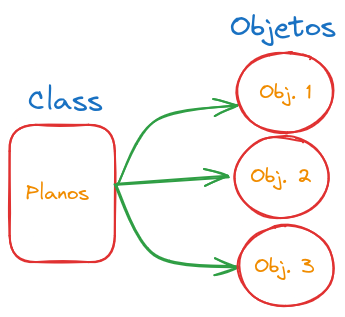

- [Programación Orientada a Objetos(POO)](#programación-orientada-a-objetospoo)
- [Clases](#clases)
  - [Zona Publiic y Private](#zona-publiic-y-private)

# Programación Orientada a Objetos(POO)

La idea fundamental de los lenguajes de programación orientados a objetos
es combinar en una sola unidad tanto los datos como las funciones que operan
con estos datos.

Donde la única forma de poder acceder a sus datos, es mediante las funciones
de los objetos; también llamadas funciones miembro.

# Clases

Las clases van a ser como un plano, donde se especifica los datos, y funciones
que se incluirán en los objetos de dicha clase. Algo similar a esto, es por ejemplo
el tipo de dato `int`, este dato existe y podemos utilizarlo siempre que declaremos una variable;
de igual forma con las `class`, este va a ser un tipo de dato que indicamos lo que puede y no
realizar, mientras que los `objetos` son las variables que vamos a usar.



```CPP
//Declaracion de un clase, de preferencia en un archivo .hpp

class nombreDeLaClase{
private: // zona privada de la clase
...
public: // zona publica de la clase
...
}
```
## Zona Publiic y Private

Estas zonas son una de las características más importantes de la POO,
en dichas zonas vamos a poder específicar que parte de una clase, queremos
que se puedan acceder desde afuera de la clase.

Sirve principalmente para mantener el encapsulamiento de una clase, y para
evitar errores.

```CPP
// Persona.hpp
class Persona {
public:
    Persona();
    Persona(const Persona& orig);
    virtual ~Persona();
    // funciones
    void getName(const char *name);
    void printName(void);
private:
    char *nombre;
    char *apellido;
    int edad;
};
// Persona.cpps
// Percatarce que las funciones llevan el nombre de la clase a la que pertenecen, seguido de `::`
void Persona::getName(const char *name) {
    nombre = new char [strlen(name) + 1];
    strcpy(nombre, name);
}

void Persona::printName(void) {
    std::cout << "El nombre de la persona es: " << nombre << std::endl;
}
// main.cpp
int main(int argc, char **argv) {
    Persona person;
    person.getName("Jesus Huayhua");
    person.printName();
    //std::cout << person.nombre << std::endl; // is private within this context
    return 0;
}
```

> [!TIP]
> Se suele hacer que los datos de una clase sean privados, mientras
> que las funciones que operadan dichos valores, sean publicas. Pero,
> no existe alguna normal al respecto de esto.

> [!NOTE]
> En el ejemplo anterior, se ve como en la funcion main.cpp, se llama a
> las funciones miembros de la clase, a esto ciertos lenguajes de programación
> los llama *mensajes*.
